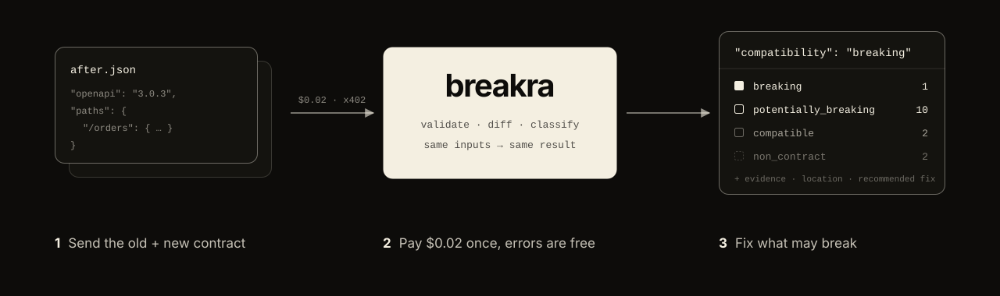
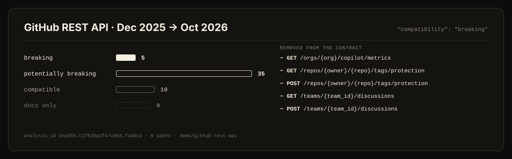
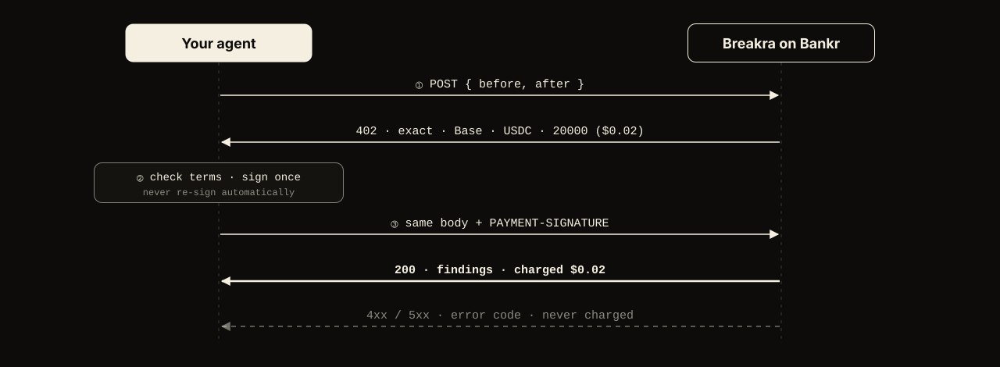

<p align="center">
  
</p>

<p align="center">
  <a href="https://breakra.dev"></a>&nbsp;
  <a href="https://github.com/danbuildss/breakra/stargazers"></a>&nbsp;
  <a href="SKILL.md"></a>&nbsp;
  <a href="demo/github-rest-api/"></a>&nbsp;
  <a href="docs/API.md"></a>&nbsp;
  <a href="CONTRIBUTING.md"></a>
</p>

<p align="center">
  Breakra compares two OpenAPI 3.0 contracts and tells a coding agent what may break: every change, classified, with the evidence and a recommended fix.<br/>
  <strong>One HTTP call. $0.02 USDC on Base via x402. Errors are free.</strong>
</p>

> **🤖 Using a coding agent?** Point it here: **read https://breakra.dev/skill.md and follow it to check an OpenAPI change.**

<div align="center">

[](https://github.com/danbuildss/breakra/actions/workflows/ci.yml)
[](LICENSE)
[](#how-payment-works)
[](https://www.x402.org)
[](RULES.md)
[](https://spec.openapis.org/oas/v3.0.3)

</div>

---

## How it works

<p align="center">
  
</p>

Send the old and the new contract. Breakra validates both, diffs them, and classifies every change by **who it affects** (request or response side) and **how** (narrowing, widening, removal). The same inputs always give the same `analysis_id` and the same findings, so a result can be kept with the change that caused it.

## Quick start

**Endpoint:** `POST https://x402.bankr.bot/0xb98f0de777eea8c481b64e33d3e0066cea38fa91/breakra-analyze`

```json
{ "before": { "openapi": "3.0.3", "…": "…" }, "after": { "openapi": "3.0.3", "…": "…" } }
```

<details open>
<summary><b>With a coding agent</b></summary>
<br/>

Give your agent [`SKILL.md`](SKILL.md). It covers when to call Breakra, the exact payment terms to check before signing, and how to act on each finding.

</details>

<details>
<summary><b>With the TypeScript client</b></summary>
<br/>

```bash
git clone https://github.com/danbuildss/breakra && cd breakra && bun install
BREAKRA_KEY_FILE=./wallet.key bun examples/client.ts old.json new.json
```

[`examples/client.ts`](examples/client.ts) checks the terms before signing (exact, Base, USDC, at most $0.02), signs once and never re-sends with a new payment. Use a dedicated low-balance wallet.

</details>

<details>
<summary><b>With curl (see the payment terms)</b></summary>
<br/>

```bash
curl -i -X POST -H 'content-type: application/json' --data @examples/request.json \
  https://x402.bankr.bot/0xb98f0de777eea8c481b64e33d3e0066cea38fa91/breakra-analyze
# → 402 with the x402 terms in the payment-required header. Paying needs an x402 client.
```

</details>

## A real example

<p align="center">
  
</p>

Six paths of GitHub's published REST API description, Dec 2025 → Oct 2026: team discussions, tag protection and Copilot org metrics are gone from the contract; the issue timeline gained 13 event types; billing budget fields were dropped from `PATCH`. Inputs, full output and write-up: [`demo/github-rest-api/`](demo/github-rest-api/).

## What each finding means

| `compatibility` | Meaning | What to do |
|---|---|---|
| `breaking` | Existing callers **will** fail (a removed operation) | Block the release, or ship a new major version |
| `potentially_breaking` | Some callers **may** fail: a new required input, a removed or now-optional response field, a new enum value… | Review each finding |
| `unknown` | Changed in a way the rules don't evaluate | Review by hand; never treat as safe |
| `compatible` | Additive; well-behaved callers are unaffected | Nothing |
| `non_contract` | Documentation or metadata only | Nothing |

Each finding carries a stable `rule` id, the `operation`, a `location` (parameter, status, media type, field), `evidence` (before/after values), a `reason` and a `recommended_action`. Full rule table: [`RULES.md`](RULES.md). Response schema: [`openapi.json`](openapi.json).

## How payment works

<p align="center">
  
</p>

- Paid with [x402](https://www.x402.org) on Base: `exact` scheme, USDC, `20000` ($0.02), to Bankr's fee router. Hosted on Bankr x402 Cloud.
- **Only a 200 is charged.** Invalid input, oversize specs and errors return 4xx/5xx and are free.
- **Sign once per call.** A reused signature is rejected; a new signature is a new charge.

## Limits and privacy

- OpenAPI **3.0.0–3.0.4 JSON**, inline. Not yet: OpenAPI 3.1, Swagger 2.0, YAML, URL inputs.
- Request body ≤ **1 MB**; nesting, operation and `$ref`-expansion limits apply. Over a limit → a free 413 or 422.
- External `$ref`s are **never fetched**; they're listed in `limitations`.
- Submitted contracts are **not stored or logged**. Logs hold only outcome, size, change count, duration and the paying address.

## Docs

| | |
|---|---|
| [breakra.dev](https://breakra.dev) | Website; agents can fetch [`/skill.md`](https://breakra.dev/skill.md) and [`/openapi.json`](https://breakra.dev/openapi.json) there |
| [`SKILL.md`](SKILL.md) | Agent guide: when to call, payment terms, reading results |
| [`docs/API.md`](docs/API.md) | Request, response and error reference |
| [`openapi.json`](openapi.json) | Machine-readable contract of the endpoint |
| [`RULES.md`](RULES.md) | Every classification rule (rule set 0.1.0) |
| [`examples/`](examples/) | Sample request and response, paying client, curl |
| [`demo/github-rest-api/`](demo/github-rest-api/) | Real-world run on GitHub's API description |
| [`SECURITY.md`](SECURITY.md) | Reporting vulnerabilities privately |

## Development

Requires [Bun](https://bun.sh) ≥ 1.4.2.

```bash
bun install --frozen-lockfile
bun run check      # typecheck, lint, tests, build, smoke test of the built handler
bun run oracle     # cross-check against oasdiff v1.33.0 (also runs in CI)
```

| Path | What |
|---|---|
| `src/core/validate.ts` | Validation and resource limits |
| `src/core/compare.ts` | Raw diff via [api-smart-diff](https://github.com/udamir/api-smart-diff) |
| `src/core/classify.ts` | The rules |
| `src/index.ts` | The HTTP handler, built into one file for Bankr (`bun run build`) |
| `tests/` | Rule, validation, handler, docs-drift and metrics tests |

Releases and deployment: [`docs/DEPLOYMENT.md`](docs/DEPLOYMENT.md). Project history and decisions live in [`docs/project/`](docs/project/).

## We love contributors

The most useful contribution is a **wrong finding**: a change Breakra misclassified or missed. Open one with the [*Report a wrong finding*](https://github.com/danbuildss/breakra/issues/new?template=wrong-finding.yml) template, with a minimal before/after pair. New rules, fixes and docs are welcome too: start with [CONTRIBUTING.md](CONTRIBUTING.md).

## License

[MIT](LICENSE). The built handler bundles [api-smart-diff](https://github.com/udamir/api-smart-diff) (MIT).
